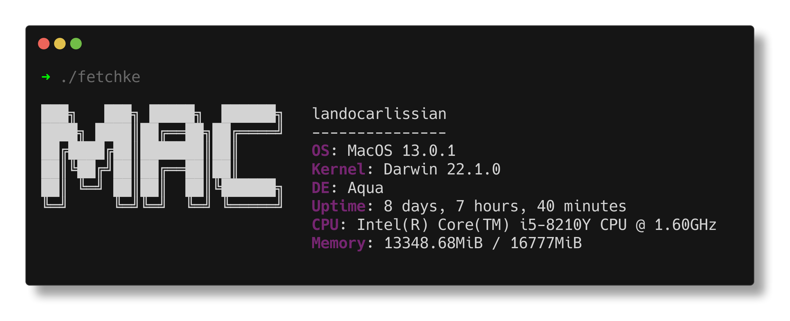

# 🦅 fetchke 🦅
A minimalistic system information tool written in Rust.

<p align="center"></p>

## 🤔 why?
Because I'm learning Rust.
## 🚀 is it fast?
Yep, it seems quite fast:
```
$ time ./fetchke
> ./fetchke  0.01s user 0.03s system 86% cpu 0.056 total
```

## ✔️ TODO
- [ ] make it customizable using command line arguments
- [x] test other platforms
